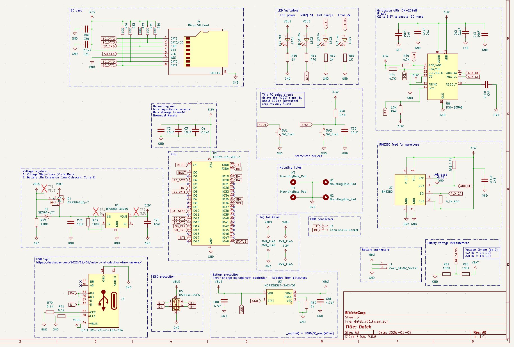
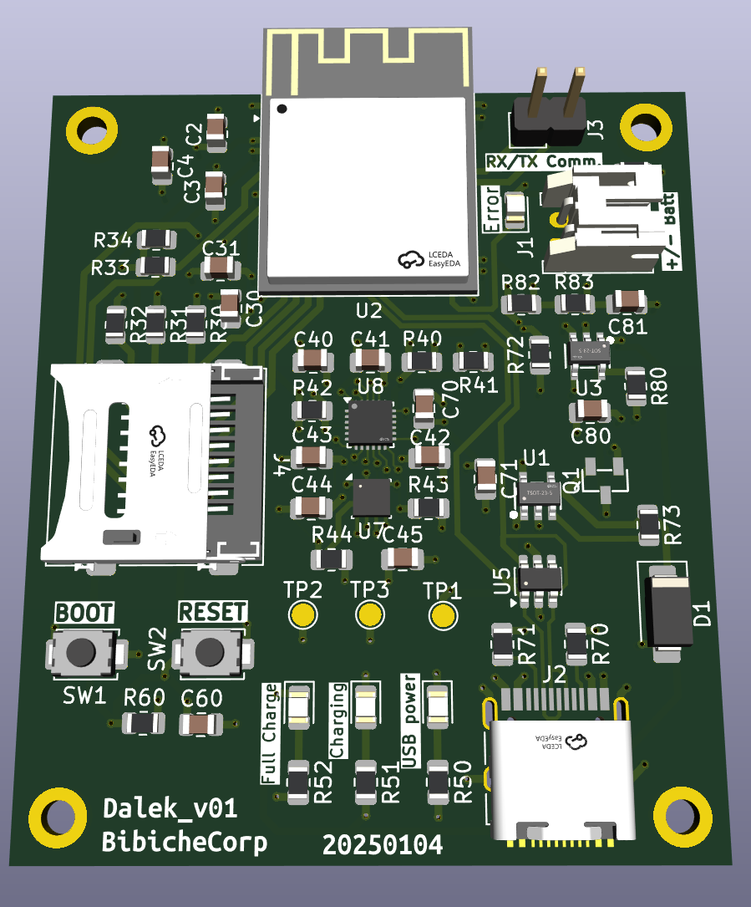
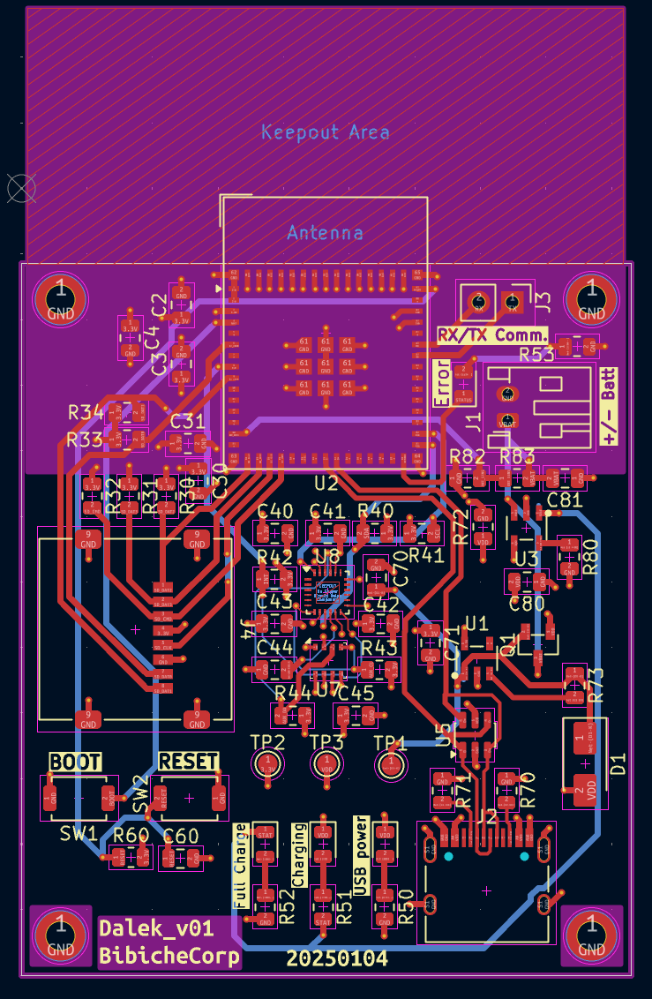

# DALEK: Data Acquisition Long-distance Environmental Kit

## Concept
DALEK is a portable remote sensing and telemetry platform built on the ESP32-S2.
It combines precision inertial navigation and is designed for field deployment.

## 10 DoF
The device uses the gyroscope and accelerometer to calculate the precise pitch and roll of the unit. When combined with the BME280's altitude data, the DALEK will perform complex Remote Sensing tasks (not yet defined).

## BOM
- Brain: ESP32-S2 (Single-core Wi-Fi SoC) optimized for low-power data polling.

- Inertial Suite: ICM-20948 providing 9 Degrees of Freedom (DoF) for precise tilt and orientation sensing.

- Atmospheric Suite: BME280 for real-time Temperature, Humidity, and Pressure/Altitude monitoring.

- Storage: Integrated MicroSD card slot for autonomous data logging (CSV format).

- Power Management: Custom PCB designed for LiPo Battery operation. On-board Voltage Regulator & Charging circuit (USB-C 5V to LiPo).

## PCB Design
<table align="center">
  <tr>
    <td align="center" colspan="2">
       
      <b>Schematic of the board.</b>
    </td>
  </tr>
  <tr>
    <td align="center">
       
      <b>3D view of the pcb.</b>
    </td>
    <td align="center">
       
      <b>PCB layers.</b>
    </td>
  </tr>
</table>

## Roadmap
### Version 0.0.1: BreadBoard
- [x] Design pcb
- [ ] Proof of concept for software
- [ ] Test pcb
